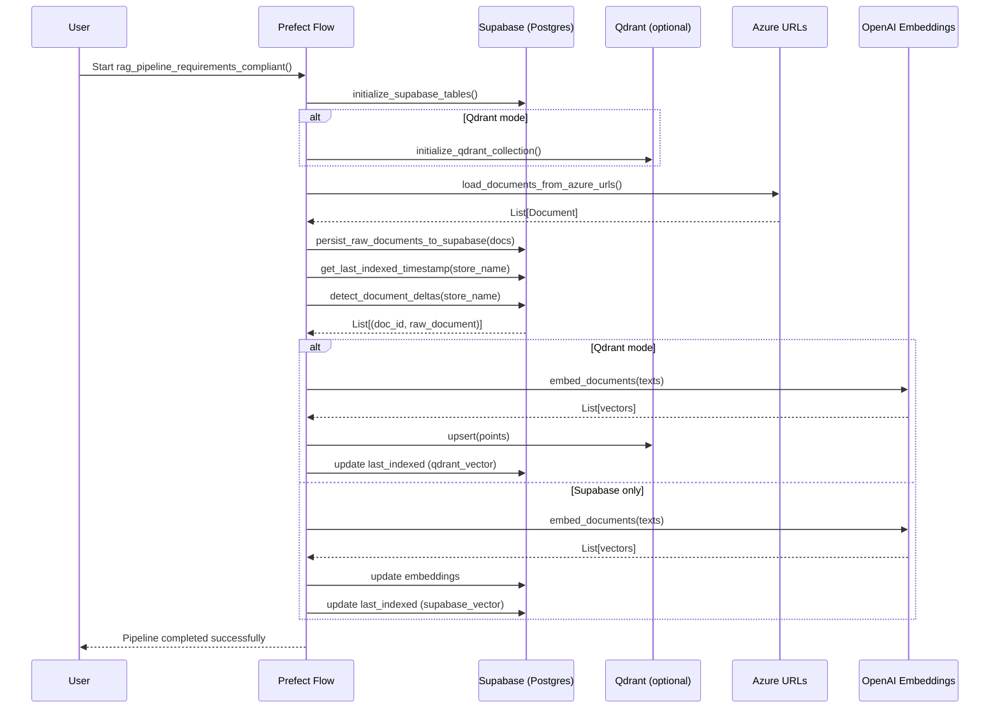

```mermaid
sequenceDiagram
    participant User
    participant PrefectFlow as Prefect Flow
    participant SupabaseDB as Supabase (Postgres)
    participant Qdrant as Qdrant (optional)
    participant Azure as Azure URLs
    participant OpenAI as OpenAI Embeddings

    User->>PrefectFlow: Start rag_pipeline_requirements_compliant()
    PrefectFlow->>SupabaseDB: initialize_supabase_tables()
    alt Qdrant mode
        PrefectFlow->>Qdrant: initialize_qdrant_collection()
    end
    PrefectFlow->>Azure: load_documents_from_azure_urls()
    Azure-->>PrefectFlow: List[Document]
    PrefectFlow->>SupabaseDB: persist_raw_documents_to_supabase(docs)
    PrefectFlow->>SupabaseDB: get_last_indexed_timestamp(store_name)
    PrefectFlow->>SupabaseDB: detect_document_deltas(store_name)
    SupabaseDB-->>PrefectFlow: List[(doc_id, raw_document)]
    alt Qdrant mode
        PrefectFlow->>OpenAI: embed_documents(texts)
        OpenAI-->>PrefectFlow: List[vectors]
        PrefectFlow->>Qdrant: upsert(points)
        PrefectFlow->>SupabaseDB: update last_indexed (qdrant_vector)
    else Supabase only
        PrefectFlow->>OpenAI: embed_documents(texts)
        OpenAI-->>PrefectFlow: List[vectors]
        PrefectFlow->>SupabaseDB: update embeddings
        PrefectFlow->>SupabaseDB: update last_indexed (supabase_vector)
    end
    PrefectFlow-->>User: Pipeline completed successfully

```