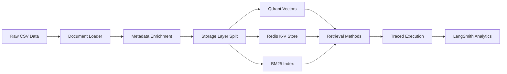

# 5-Minute Methodology Storyboard: Building Reliable RAG Analysis

## **Slide 1: The Research Design Challenge (0:00-0:30)**
### "How Do You Compare Apples to Apples?"

**Visual**: Split screen showing:
- Left: 7 different retrieval methods (messy, inconsistent)
- Right: Scientific experimental design (controlled, systematic)

**Narration**: "Comparing retrieval methods is like comparing different search engines - each uses different algorithms, data structures, and optimization strategies. How do you ensure your comparison is fair, reliable, and actionable?"

**Key Insight**: Without proper experimental design, you're just collecting anecdotes.

---

## **Slide 2: Establishing Experimental Controls (0:30-1:15)**
### "Same Dataset, Same Question, Same Infrastructure"

**Visual**: Control tower diagram:

```
CONTROLLED VARIABLES
├── Dataset: John Wick reviews (consistent corpus)
├── Question: "Did people generally like John Wick?"
├── LLM: GPT-4.1-mini (same reasoning engine)
├── Embeddings: text-embedding-3-small (same vectorization)
└── Infrastructure: Docker Compose (identical environment)
```

**Narration**: "Every scientific experiment needs controls. We use the same dataset, same test question, same AI models, and identical infrastructure. This isolates the variable we actually want to test: the retrieval method itself."

**Key Method**: Control for everything except the variable you're measuring.

---

## **Slide 3: Instrumentation & Observability Setup (1:15-2:00)**
### "If You Can't Measure It, You Can't Improve It"

**Visual**: Monitoring dashboard showing multiple measurement layers:

```python
@traceable(name="method_name", metadata={"method":"type"})
def trace_retrieval_method(question: str):
    # Automatic capture of:
    # - Execution time
    # - Token usage  
    # - API costs
    # - Context documents retrieved
    # - Errors and exceptions
```

**Narration**: "Each retrieval method is wrapped with tracing decorators that automatically capture performance metrics. We're not just collecting responses - we're measuring latency, cost, token usage, and error rates in real-time."

**Key Method**: Instrument first, experiment second. No measurement = no learning.

---

## **Slide 4: Data Pipeline Architecture (2:00-2:45)**
### "Reproducible Infrastructure as Code"

**Visual**: Infrastructure flow diagram:



**Narration**: "The infrastructure is completely reproducible. Docker Compose brings up identical Qdrant and Redis instances. Data loading is scripted and deterministic. Each storage type is initialized with the same source documents but optimized for different retrieval patterns."

**Key Method**: Infrastructure as Code enables reliable replication.

---

## **Slide 5: Systematic Testing Protocol (2:45-3:30)**
### "Execution Order Matters"

**Visual**: Testing protocol checklist:

```
TESTING PROTOCOL
✅ 1. Environment startup (docker compose up -d)
✅ 2. Data loading & preprocessing (consistent metadata)
✅ 3. Storage initialization (all methods from same source)
✅ 4. Tracing activation (LangSmith project creation)
✅ 5. Sequential execution (same question, all methods)
✅ 6. Trace completion wait (ensure all data captured)
✅ 7. Data extraction & analysis (automated dataset creation)
```

**Narration**: "The execution follows a strict protocol. All infrastructure starts clean, data loads identically, and each method runs against the same question in sequence. We wait for all traces to complete before analysis to ensure complete data capture."

**Key Method**: Systematic execution prevents confounding variables.

---

## **Slide 6: Analysis Framework & Validation (3:30-4:15)**
### "From Raw Data to Actionable Insights"

**Visual**: Analysis pipeline:

```
RAW TRACES → STRUCTURED DATA → COMPARATIVE ANALYSIS
    ↓              ↓                    ↓
- Runtime logs   - Pandas DataFrame   - Performance matrix
- Token counts   - Standardized       - Trade-off analysis  
- Error states     metrics            - Decision framework
- Cost data      - Metadata joins     - Recommendations
```

**Narration**: "Raw execution traces get transformed into structured datasets with standardized metrics. This enables comparative analysis across dimensions: quality, speed, cost, and resource usage. The analysis framework produces actionable insights, not just numbers."

**Key Method**: Structured analysis transforms data into decisions.

---

## **Slide 7: Replicability & Knowledge Capture (4:15-5:00)**
### "Science You Can Build On"

**Visual**: Knowledge artifact pyramid:

```
         🎯 ACTIONABLE INSIGHTS
        ├── Decision Framework
       ├─── Performance Matrix
      ├──── Standardized Datasets  
     ├───── Execution Traces
    ├────── Infrastructure as Code
   └─────── Raw Data & Methods
```

**Narration**: "Everything is captured for replication: the raw data, infrastructure definitions, execution protocols, trace data, and analysis methods. Other teams can reproduce these results, extend the analysis to new datasets, or adapt the methodology for different use cases."

**Final Takeaway**: "Reliable RAG analysis isn't about finding the 'best' method - it's about building systematic processes that generate trustworthy insights for decision-making."

---

## **Core Methodology Principles**

🔬 **Experimental Control**: Isolate the variable you're testing  
📊 **Comprehensive Instrumentation**: Measure everything automatically  
🏗️ **Reproducible Infrastructure**: Code your environment  
📋 **Systematic Protocols**: Define and follow execution procedures  
📈 **Structured Analysis**: Transform data into insights  
🔄 **Replicable Process**: Enable others to build on your work