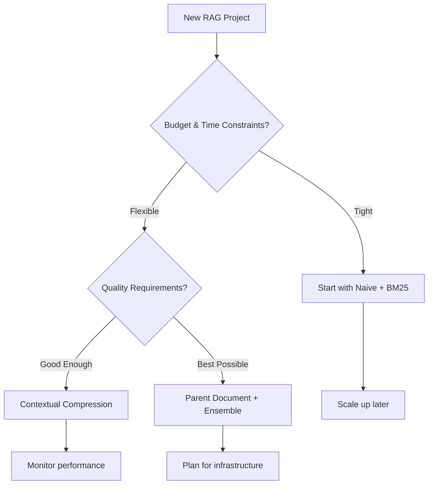

# 5-Minute Storyboard: LangChain Retrieval Methods

## **Slide 1: The Problem (0:00-0:30)**
### "Why RAG Retrieval Matters"

**Visual**: Split screen showing:
- Left: Massive document pile (John Wick movie reviews)
- Right: Single search query bubble

**Narration**: "You have thousands of documents, but users ask specific questions. How do you find the RIGHT information quickly and accurately? This is the core challenge of Retrieval-Augmented Generation."

**Key Point**: Not all retrieval methods are created equal.

---

## **Slide 2: The Laboratory Setup (0:30-1:00)**
### "Building Our Test Environment"

**Visual**: Infrastructure diagram showing:
```
Docker Compose
├── Qdrant (Vector DB)
├── Redis (Key-Value Store)
└── OpenAI APIs (Embeddings + LLM)
```

**Narration**: "We're testing 7 different retrieval strategies using John Wick movie reviews as our dataset. Each method stores and searches information differently."

**Key Point**: Consistent testing environment = reliable comparisons.

---

## **Slide 3: The Seven Strategies (1:00-2:30)**
### "From Simple to Sophisticated"

**Visual**: Progressive complexity chart:

#### **Level 1: Foundation Methods**
- **Naive**: Whole documents → vectors
- **BM25**: Keywords matching (like Google search)

#### **Level 2: AI-Enhanced Methods**
- **Contextual Compression**: AI reranks results
- **Multi-Query**: Expands your question into multiple searches

#### **Level 3: Architectural Methods**
- **Parent Document**: Small chunks point to big context
- **Ensemble**: Combines multiple methods
- **Semantic**: AI understands content boundaries

**Narration**: "Each method trades off between speed, accuracy, and complexity. Simple methods are fast but might miss nuance. Advanced methods are thorough but use more resources."

---

## **Slide 4: The Performance Matrix (2:30-3:30)**
### "Measuring What Matters"

**Visual**: 4-quadrant performance dashboard:

```
┌─────────────────┬─────────────────┐
│   QUALITY       │    LATENCY      │
│                 │                 │
│ • Recall        │ • ms per query  │
│ • Relevance     │ • API calls     │
│ • Context docs  │ • Token usage   │
└─────────────────┼─────────────────┤
│     COST        │   RESOURCES     │
│                 │                 │
│ • API tokens    │ • Index size    │
│ • Rerank calls  │ • Memory usage  │
│ • Total spend   │ • Storage type  │
└─────────────────┴─────────────────┘
```

**Narration**: "We track four key dimensions: How good are the results? How fast does it run? What does it cost? How much infrastructure does it need?"

---

## **Slide 5: Real Results Deep Dive (3:30-4:15)**
### "What Actually Happened"

**Visual**: Side-by-side comparison table:

| Method | Response Quality | Speed | Cost | Best For |
|--------|-----------------|--------|------|----------|
| **Naive** | ⭐⭐⭐ | 🚀🚀🚀 | 💰 | Quick prototypes |
| **BM25** | ⭐⭐ | 🚀🚀🚀 | Free | Exact keyword match |
| **Compression** | ⭐⭐⭐⭐ | 🚀🚀 | 💰💰 | High precision needed |
| **Multi-Query** | ⭐⭐⭐⭐ | 🚀 | 💰💰💰 | Complex questions |
| **Parent Doc** | ⭐⭐⭐⭐⭐ | 🚀🚀 | 💰💰 | Full context matters |
| **Ensemble** | ⭐⭐⭐⭐⭐ | 🚀 | 💰💰💰 | Best overall results |
| **Semantic** | ⭐⭐⭐⭐ | 🚀🚀 | 💰💰 | Natural boundaries |

**Narration**: "Parent Document and Ensemble methods provided the best answers but required more infrastructure. BM25 was surprisingly effective for simple keyword queries."

---

## **Slide 6: Production Decision Framework (4:15-5:00)**
### "Choosing Your Strategy"

**Visual**: Decision tree flowchart:



**Narration**: "Start simple, measure everything, then scale up. The 'best' method depends on your specific needs: user tolerance for imperfect answers, budget for API calls, and infrastructure complexity you can handle."

**Final Takeaway**: "Modern RAG isn't one-size-fits-all. It's about choosing the right tool for your specific context and constraints."

---

## **Key Takeaways Box**
✅ **Start Simple**: Naive or BM25 for MVP  
✅ **Measure Everything**: Quality, speed, cost, resources  
✅ **Scale Thoughtfully**: Advanced methods when justified  
✅ **Infrastructure Matters**: Redis + Qdrant enable sophisticated approaches  
✅ **Context Wins**: Parent Document retrieval often provides best user experience